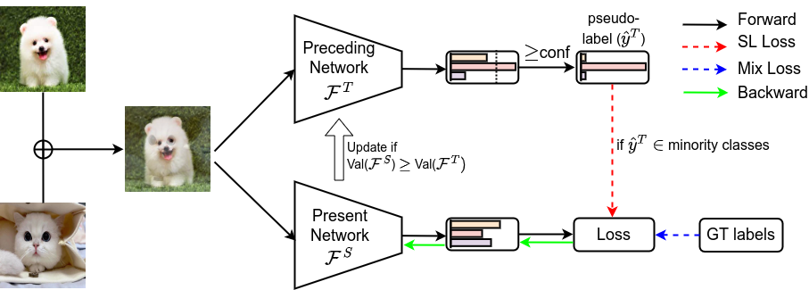

# LCSL: Long-tailed Classification via Self-labeling

By Anonymous submission

## Overview
Code for the paper "LCSL: Long-tailed Classification via Self-labeling".

### Abstract
Deep long-tailed learning is still considered a significant challenge problem in the real open world as given data tends to follow the long-tailed distribution. It affects the training process of classifiers because of the poor generalization of minority classes, leading to an undesirable bias towards common classes in terms of higher accuracy. A larger number of studies have been conducted in recent years to find a way to increase the accuracy of minority classes, such as class re-balancing, information augmentation, and module improvement. Among various methods, information augmentation is one of the most practical compared to other methods in real-world applications. However, it is disadvantageous to simply use existing class-agnostic augmentation strategies to improve long-tailed learning because they could worsen imbalance given that head classes contain more samples and would be more skewed. In this work, we propose the long-tailed classification via the self-labeling (LCSL) method to (1) manage new samples from data augmentation to avoid more imbalance, (2) reduce the uncertainty of class prediction problems for minority classes, and (3) decrease over-fitting model training by incremental learning. Extensive experimental results reveal that our approach obtains state-of-the-art accuracy on three standard benchmarks with different imbalance ratios. More specifically, our LCSL obtains \textbf{85.8%, 54.4%, 56.2%} accuracy on CIFAR10, CIFAR100, and ImageNet-LT, respectively, with an imbalance ratio of 100. 

  

## Running the code

### Requirements
- Python3
- Pytorch
- numpy 
- Pillow
- opencv
- ...

### Training

In this code, you can reproduce the experiment results of the LCSL approach for Long-tailed Classification.
The datasets are all open-sourced, so it is easy to download.
Detailed hyperparameter settings are enumerated in the paper.

- Training with LCSL
~~~
python train_LCSL.py --dataset='cifar100' --batch_size=64 --imb_factor=0.01 --alpha=1. --beta=1. --lr=0.01 \
--gpu=0 --weight_decay=5e-3 --epochs=300 --lambda_init=0.5
~~~
In which,

`--gpu=0` denotes which GPU we use to train the network, if you want to use multi-GPUs, you can set `--gpu=0,1,2,3`.

`--dataset=cifar100` denotes the dataset used for training.

`--imb_factor=0.01` is imbalance factor which only apply for cifar10 and cifar100 datasets.

`--alpha=1` and `--beta=1` are two loss weights.

`--lr=0.01` is the learning rate init.

`--epochs=300` denotes the number of epochs for training

`--lambda_init=0.5` is the hyperparameter `conf`

All datasets should be saved in the folder `"datasets"` 
